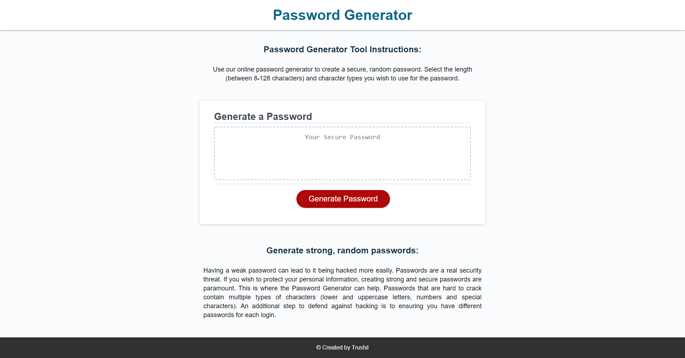

# PasswordGenerator

## Description

An application that enables the user to generate a random password based on criteria they have selected.

The user can select the length of the password and whether it includes lower case, upper case, number and/or special characters. At least one character type needs to be selected in order for a password to be generated.

The password length needs to be between 8-128 characters.

Once the prompts are answered and the information verfied, the randomized password will be displayed in the web page based on the criteria the user has selected.

## Link

The link to the deployed application:

Password Generator: https://trushilbudhia.github.io/PasswordGenerator/

## Assets

The following image shows the web application's appearance:

> **Note**: This layout is responsive.