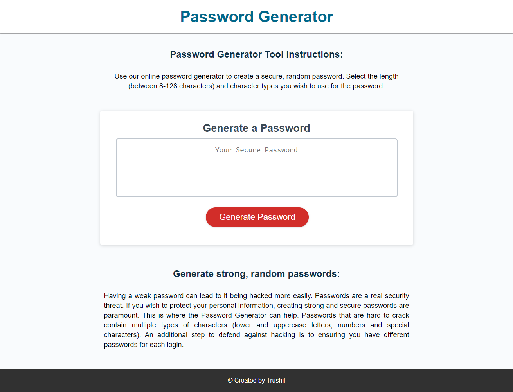

# Password Generator

## 📖Table of Contents
1. [Description](#✒️description)
2. [Link](#🚀Link)
3. [Screenshots](#🎉Screenshots)
4. [Technologies](#💻Technologies)
5. [Contributing](#🤝Contributing)
6. [Author](#👾Author)
7. [License](#📝License)

## ✒️Description
An application that enables the user to generate a random password based on criteria they have selected.

The user can select the length of the password and whether it includes lower case, upper case, number and/or special characters. At least one character type needs to be selected in order for a password to be generated.

The password length needs to be between 8-128 characters.

Once the prompts are answered and the information verfied, the randomized password will be displayed in the web page based on the criteria the user has selected.

## 🚀Link
The link to the deployed application:

Password Generator: https://trushilbudhia.github.io/Password-Generator/

## 🎉Screenshots
The following images show the web application's appearance:

> **Note**: This layout is responsive.

## 💻Technologies
- JavaScript
- HTML
- CSS
- Font Awesome (icons)

## 🤝Contributing
Contributions, issues and feature requests are welcome.

Feel free to check [issues page](https://github.com/TrushilBudhia/PasswordGenerator/issues) if you want to contribute.

## 👾Author
👤Trushil Budhia
- Github: [@Trushil](https://github.com/TrushilBudhia)
- Email: trushil.budhia@gmail.com

## 📝License
Copyright © 2021 [Trushil](https://github.com/TrushilBudhia)

This project is [MIT](./LICENSE.md) licensed
